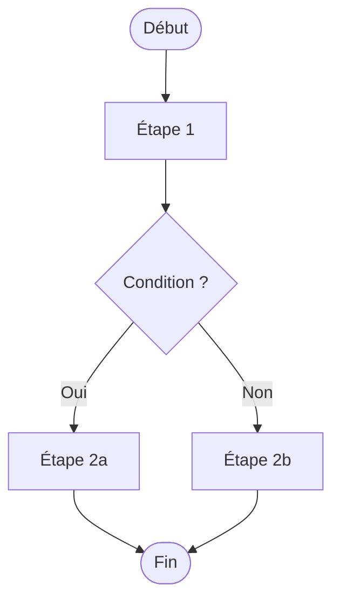

# Compétence : Livrables projet

Produire les documents professionnels qui accompagnent chaque projet livré.

## Documents disponibles

| Document | Usage |
|---|---|
| Note de cadrage | Lancer un projet — aligner client et prestataire |
| Cahier des charges fonctionnel | Détailler les besoins et exigences |
| Cahier de recette | Valider que le livrable fonctionne comme attendu |
| Schéma BPMN / flux de processus | Visualiser un processus métier |
| Documentation technique | Documenter un scénario Make/n8n ou une app |
| Guide utilisateur | Expliquer comment utiliser le livrable |
| Rapport de livraison | Clôturer et remettre officiellement un projet |

---

## Template — Note de cadrage (format école / examen)

> Structure validée pour usage professionnel et examen final.
> Convention : [texte entre crochets] = à remplacer.

```
Référence : [ex. CADRE-2026001]

# Note de cadrage — [Nom du projet]

**Client :** [Nom]
**Prestataire :** Clockwork Ops — Stéphanie
**Date :** [JJ/MM/AAAA]
**Version :** 1.0

---

## 🏔 Contexte

[Présenter le client, son activité, sa situation actuelle et pourquoi ce projet émerge maintenant.
Inclure : taille structure, secteur, enjeux de croissance ou de transformation.]

---

## 🪫 Le besoin / les enjeux

[Formuler l'enjeu central en une phrase forte, puis détailler en points :]

- **Enjeu 1 :** [Titre] — [Description]
- **Enjeu 2 :** [Titre] — [Description]
- **Enjeu 3 :** [Titre] — [Description]

---

## 🔍 Compréhension du besoin

[Résumé de ce que le projet va concrètement construire / automatiser / livrer.]

### Nombre prévisionnel d'utilisateurs

- **Internes :** [nb] personnes
- **Externes :** [nb] utilisateurs (clients, visiteurs, etc.)

### Profils utilisateurs

- **[Profil 1] :** [Accès et responsabilités]
- **[Profil 2] :** [Accès et responsabilités]
- **[Profil 3] :** [Accès et responsabilités]

### Droits d'accès

Convention : **L** = Lecture | **C** = Création | **M** = Modification | **S** = Suppression

| Données / Actions | [Profil 1] | [Profil 2] | [Profil 3] |
|---|---|---|---|
| [Exemple : Réservations] | L.C.M.S | L | L.M |
| | | | |

### Contraintes opérationnelles identifiées

[Lister les contraintes techniques, délais non négociables, dépendances externes.]

### Gestion des données

**Données sensibles business :**
[Données critiques pour le client : CA, planning, contacts, etc.]

**Données personnelles :**
[Données personnelles collectées et traitées : noms, emails, etc.]

---

## 🗺️ Le périmètre

[Ce que cette prestation couvre précisément — être très explicite.]

---

## ❌ Exclusions

[Ce que la prestation NE couvre PAS. Protège les deux parties.]

- [Exclusion 1]
- [Exclusion 2]

---

## ⚙️ Identification des fonctions principales de la solution

[Lister les fonctionnalités / modules qui seront mis en œuvre :]

- **[Fonction 1]** — [Description courte]
- **[Fonction 2]** — [Description courte]
- **[Fonction 3]** — [Description courte]

---

## 🧰 La stack

[Expliquer les choix technologiques et pourquoi (no-code, modulaire, etc.)]

Outils retenus :
- [Outil 1] — [Rôle]
- [Outil 2] — [Rôle]
- [Outil 3] — [Rôle]

---

## ✅ Les pré-requis

[Ce que le CLIENT doit fournir AVANT ou PENDANT la prestation — verrouiller ce point.]

Le client devra fournir :

**Comptes à créer :**
- [ ] [Outil 1]
- [ ] [Outil 2]

**Éléments à fournir :**
- [ ] [Élément 1]
- [ ] [Élément 2]

---

## 📋 Organisation

### Les parties prenantes

| Rôle | Nom | Responsabilité dans le projet |
|---|---|---|
| Client / décideur | [Nom] | Validation, recette, accès |
| Prestataire | Stéphanie — Clockwork Ops | Conception et réalisation |
| [Autre] | [Nom] | [Rôle] |

### Budget

[Budget alloué par le client ou devis Clockwork Ops associé à cette note.]

### Le planning et jalons

| Jalon | Date prévisionnelle |
|---|---|
| Kick-off | |
| Livraison lot 1 | |
| Livraison lot 2 | |
| Recette | |
| Mise en production | |

### Les instances de suivi

[Modalités de communication : fréquence des points, canal (email, WhatsApp, Notion), format de reporting.]

---

## 🧩 Les types d'activités du projet

Clockwork Ops met en œuvre les services suivants pour ce projet :

- ➡️ Conception / architecture de la solution
- ➡️ Développement et intégration
- ➡️ Documentation technique
- ➡️ Formation / transfert de compétences
- ➡️ Gestion de projet
- ➡️ [Support après livraison — si inclus]

---

## 📞 Le support

[Définir si un support post-livraison est inclus, pour combien de temps et par quel canal.
Exemple : support inclus 30 jours après mise en production, via WhatsApp ou email.]
```

---

## Template — Cahier de recette

```
# Cahier de recette — [Nom du projet]

**Client :** [Nom]
**Prestataire :** Clockwork Ops
**Date de recette :** [JJ/MM/AAAA]

## Périmètre des tests
[Ce qui est testé / ce qui ne l'est pas]

## Environnement de test
- URL / accès :
- Données de test :

## Cas de test

| ID | Scénario | Données d'entrée | Résultat attendu | Résultat obtenu | Statut |
|---|---|---|---|---|---|
| T01 | | | | | ✅ / ❌ |

## Critères d'acceptation
- [ ] Tous les cas critiques passés
- [ ] Aucun bug bloquant en suspens
- [ ] Validé par le client

## Résultat
- [ ] Accepté sans réserve
- [ ] Accepté avec réserves
- [ ] Refusé

**Signature client :** ___________________ **Date :** ___________
```

---

## Template — Schéma BPMN (Mermaid)



---

## Template — Documentation technique scénario Make/n8n

```
# Documentation — [Nom du scénario]

**Outil :** Make / n8n | **Client :** [Nom] | **Date :** [JJ/MM/AAAA]

## Résumé
[Ce que fait ce scénario en 1-2 phrases]

## Flux
DÉCLENCHEUR → MODULE 1 → [CONDITION] → MODULE 2 → RÉSULTAT

## Modules utilisés
| # | Module | Action | Notes |
|---|---|---|---|

## Points d'attention / En cas de panne
```

---

## Template — Rapport de livraison

```
# Rapport de livraison — [Nom du projet]

**Client :** [Nom] | **Date :** [JJ/MM/AAAA]

## Ce qui est livré
| Livrable | Statut | Accès |
|---|---|---|
| | ✅ Livré | |

## Non inclus dans cette livraison
## Accès et credentials remis
## Prochaines étapes recommandées

---
*Livraison Clockwork Ops — Stéphanie*
```
