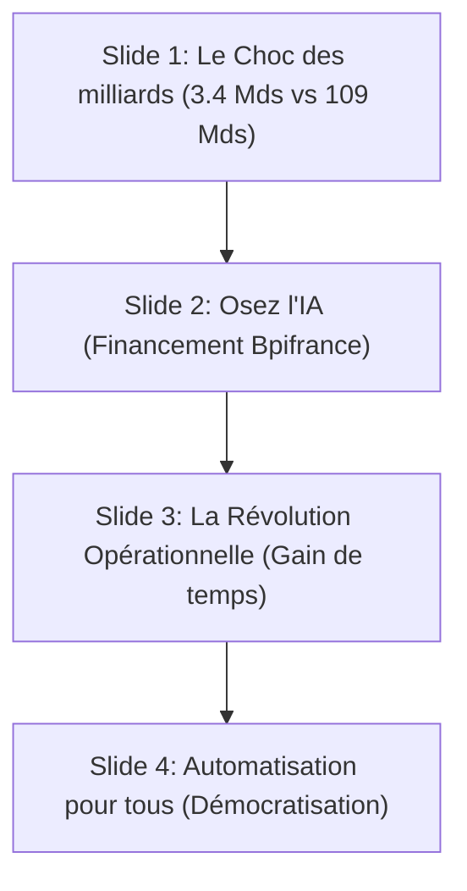

# Contenu récupéré — session 2026-05-31

> Extrait du fichier session Printify/Bonjour Beasts (mélange accidentel de sessions).
> Contenu original : slides Facebook sur l'IA en France / guide Canva.

---

### Séquence des Diapositives (Vidéo de 12 secondes au total)



#### Slide 1 : Le Choc des Milliards (Une infrastructure titanesque)
*   **Titre Principal :** Une révolution silencieuse s'organise... 🇫🇷
*   **Encart 1 (Titre : `3,4 Mds € Publics`) :** L'État finance directement le plan *France 2030* pour structurer nos pôles de recherche d'excellence (9 "IA Clusters" universitaires) et démultiplier la puissance de calcul souveraine de nos supercalculateurs publics (Jean Zay).
*   **Encart 2 (Titre : `109 Mds € Privés`) :** Le vrai séisme est ici : les plus grands fonds d'investissement mondiaux et nos géants industriels (Iliad, Orange...) s'unissent pour bâtir des infrastructures et des *Data Centers* de calcul intensif écologiques sur le sol français d'ici 2030.
*   **Encart 3 (Titre : `La Ruée vers l'Or`) :** Ce gigantisme sans précédent crée l'infrastructure nécessaire pour faire de la France le hub européen incontournable de l'IA. Pendant que le grand public découvre ces avancées, une puissance technologique colossale est en train de naître pour soutenir l'essor de tous nos projets.

#### Slide 2 : L'Opportunité Historique (Le Plan Osez l'IA)
*   **Titre Principal :** Ne passez pas à côté : Le plan "Osez l'IA" 📈
*   **Encart 1 (Titre : `200M€ Débloqués`) :** L'État ne soutient pas que les géants de la tech. Cette enveloppe massive est entièrement réservée au déploiement opérationnel de l'intelligence artificielle dans nos PME, ETI et TPE.
*   **Encart 2 (Titre : `Équiper 80% des PME`) :** Le plan national vise l'adoption de l'IA par 100 % des grands groupes, 80 % des PME/ETI et 50 % des TPE d'ici 2030 pour propulser leur compétitivité et accompagner leur transition moderne.
*   **Encart 3 (Titre : `Diagnostic financé à 80%`) :** Grâce au dispositif *IA Booster* opéré par Bpifrance, l'État prend en charge jusqu'à 80 % du coût de votre diagnostic et cadrage IA. Il n'a jamais été aussi facile et abordable de moderniser votre entreprise.

#### Slide 3 : La Révolution Opérationnelle (Passez à l'action)
*   **Titre Principal :** N'attendez pas pour rejoindre ce mouvement ! ⚙️
*   **Encart 1 (Titre : `Liberez 30% de votre semaine`) :** Intégrer l'IA et l'automatisation permet de déléguer en moyenne 20 % à 30 % des tâches répétitives hebdomadaires. Vous récupérez un temps précieux pour vous concentrer sur ce qui crée de la vraie valeur.
*   **Encart 2 (Titre : `Des solutions prêtes à l'emploi`) :** Support client intelligent disponible 24h/24, tri sémantique automatique des e-mails, prédictions de facturation, ou création assistée de contenus. Les outils no-code sont mûrs, fiables et faciles d'accès.
*   **Encart 3 (Titre : `Le train n'attendra pas`) :** Les aides de l'État sont disponibles et les technologies sont au point. Attendre, c'est passer à côté de l'opportunité de libérer son potentiel dès aujourd'hui. C'est maintenant qu'il faut agir pour construire l'avenir de votre structure.

#### Slide 4 : Notre Vision (L'automatisation accessible à tous)
*   **Titre Principal :** L'IA et l'automatisation pour absolument TOUS 🤝
*   **Encart 1 (Titre : `Pas seulement pour les géants`) :** Les bénéfices de la productivité et du gain de temps ne doivent pas rester un privilège réservé aux grands groupes. Chaque entrepreneur, indépendant, TPE ou créateur de projet mérite d'en profiter.
*   **Encart 2 (Titre : `Démocratisation No-Code`) :** Nous œuvrons pour rendre l'IA et les flux de travail automatisés simples, abordables et compréhensibles pour les petites structures et les particuliers, afin de libérer pleinement le potentiel créatif humain.
*   **Encart 3 (Titre : `Exprimez-vous en commentaire !`) :** L'automatisation va-t-elle détruire des métiers ou au contraire libérer les esprits ? Rejoignez le mouvement, participez au débat et dites-nous ce que vous en pensez en commentaires !

---

## Guide de Conception Pas-à-Pas sur Canva

Pour cette présentation, exploitation de **Canva Magic Design pour Présentation** (format 16:9 ou présentation carrée).

---

### Phase A : Génération de la Présentation Statique via l'IA Canva

Copiez-collez ce prompt dans l'outil **« Magic Design pour Présentation »** :

```text
Génère une présentation professionnelle de 4 diapositives sous forme d'infographie technologique (DataViz). Utilise un design premium, moderne et épuré. Les couleurs doivent être un fond bleu nuit profond avec des accents bleu cyan et blanc. La police doit être géométrique et très lisible.
IMPORTANT : Chaque point clé, titre ou sous-titre doit être généré dans une zone de texte ou une carte graphique 100 % indépendante et isolée (ne pas grouper ou fusionner les textes) afin de permettre de les animer un par un à la main par la suite.
Ajoute au bas de chaque diapositive, centré et écrit en tout petit (taille 10-12 px), la mention "Source : [Texte de la source]".

Voici le contenu exact pour chaque diapositive :

Diapositive 1 : La Révolution Silencieuse de l'IA en France (Page de couverture)
- Sous-titre : Pourquoi votre entreprise ne doit pas rater le train des milliards d'ici 2030.
- Message clé : Une transformation historique s'organise dans l'ombre du grand public.
- Source : Source : Ministère de l'Économie / France 2030

Diapositive 2 : France 2030 : Le Choc des Milliards (Infrastructures)
- Titre de section : Bâtir une puissance technologique sans précédent.
- Point 1 : 3,4 Mds € d'investissements publics (France 2030) pour financer les "IA Clusters" universitaires et le calcul souverain.
- Point 2 : 109 Mds € d'investissements privés internationaux annoncés pour implanter des Data Centers géants et écologiques sur notre sol.
- Source : Source : Sommet international de l'IA Paris / Maddyness

Diapositive 3 : Osez l'IA : L'opportunité historique des PME (Le plan d'action)
- Titre de section : Propulser la compétitivité de nos petites et moyennes structures.
- Point 1 : 200 Millions d'euros débloqués par l'État spécifiquement pour l'adoption de l'IA dans les PME, ETI et TPE.
- Point 2 : Un objectif national d'équiper 80% des PME et 50% des TPE d'ici 2030 pour éviter le décrochage.
- Point 3 : Vos diagnostics et cadrages IA financés jusqu'à 80% par Bpifrance grâce au dispositif IA Booster.
- Source : Source : Bpifrance / Direction Générale des Entreprises

Diapositive 4 : L'automatisation intelligente pour absolument TOUS (Notre vision)
- Titre de section : Libérer le potentiel créatif de chaque travailleur.
- Point 1 : Entre 20% et 30% de temps de travail hebdomadaire libéré en déléguant vos tâches répétitives à l'IA.
- Point 2 : Notre combat pour rendre l'IA et les outils no-code simples, abordables et accessibles aux indépendants et particuliers.
- Point 3 : Et vous, l'automatisation va-t-elle révolutionner votre quotidien ? Dites-le nous en commentaires !
- Source : Source : Vision Démocratisation / No-Code France
```

---

### Phase B : Animation Manuelle de la Présentation

1.  **Appliquer les Animations de Page :** Cliquez sur une diapositive → **« Animer »** → choisir **« Épurée »**, **« Corporate »** ou **« Fluide »**.
2.  **Activer l'Animation des Graphiques (Slide 3) :** Si vous insérez des jauges via *Éléments > Graphiques*, l'animation de chargement s'active automatiquement.
3.  **Ajouter des Transitions Fluides :** Bouton **« + »** entre les diapositives → **« Dissolution »** ou **« Glissement »** → durée **0.5 seconde**.
4.  **Chronométrer le Diaporama :** Durée d'affichage de chaque diapositive = **3,0 secondes** → vidéo Facebook de 12 secondes au total.
