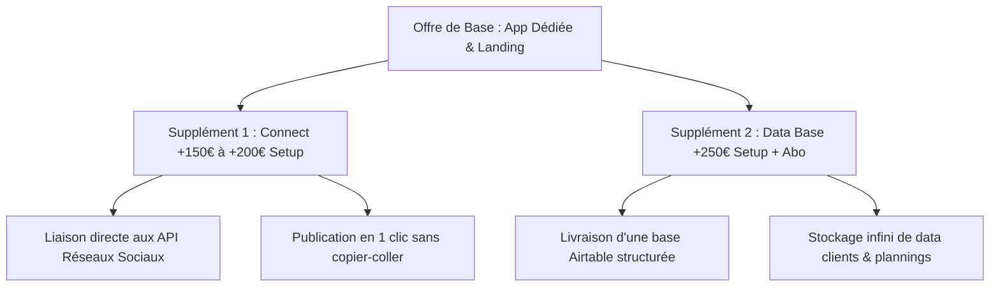

# Analyse de Marché & Stratégie Marketing : Le Pack "Content Engine"
## Modélisation Financière, Offres Locales et Options Premium

> [!IMPORTANT]
> Ce document met à jour le positionnement stratégique et financier de l'offre **"Content Engine"** de Clockwork Ops. 
> Suite aux clarifications, le produit n'est plus basé sur un assemblage No-Code standard (Softr/Airtable) mais sur une **Application Dédiée Personnelle** (Web App sur-mesure ultra-rapide et propriétaire, similaire à notre savoir-faire technique en développement d'applications). Les connexions aux réseaux sociaux et les bases de données (Airtable/Data) sont commercialisées sous forme de suppléments premiums.

---

## 1. L'Architecture Produit & Les Suppléments

L'offre de base est un outil de **SaaS sur-mesure propriétaire**. Le client dispose de son application dédiée pour générer son contenu en 1 clic grâce à l'IA de Claude. L'infrastructure est ultra-légère et économique pour toi à héberger (statique, pas d'abonnements Softr/Airtable requis pour le client).

### A. L'Offre de Base ("L'App Dédiée Génératrice")
*   **La Landing Page "Convert"** : Page vitrine esthétique et rapide pour capter ses clients locaux.
*   **L'App Dédiée Personnelle** : Un portail web-app mobile-first, épuré et ultra-simple. L'utilisateur saisit son idée ou charge son visuel, et l'application génère les posts optimisés Facebook & Instagram grâce à Claude AI. Il n'a plus qu'à copier-coller.
*   **Zéro friction technique** : Le client n'a pas à payer d'outils tiers (Airtable ou Softr) dans l'offre de base.

### B. Les Suppléments & Upgrades ("À la Carte")
Pour augmenter le panier moyen et cibler les clients plus matures techniquement :

1.  **Supplément "Connect" (Liaison Réseaux)** :
    *   *Principe* : Intégration de l'API Meta ou de scénarios automatisés pour publier directement depuis l'application sur Facebook/Instagram en un clic.
    *   *Tarif* : **+150 € à +200 € au setup** + majoration de l'abonnement mensuel pour la maintenance des API.
2.  **Supplément "Data Base" (Base Airtable complète)** :
    *   *Principe* : Pour les clients qui veulent gérer un historique massif, stocker des milliers d'idées, planifier un planning d'équipe ou gérer un mini CRM d'inscrits. On leur livre une base Airtable structurée et connectée à leur App.
    *   *Tarif* : **+250 € au setup** + **+20 € / mois** pour la gestion de base de données.

---

## 2. Analyse de Marché & Double Tarification (France vs. Suisse) 💶

La différence de pouvoir d'achat et de tarification des prestations de services entre la Haute-Savoie (Evian/Thonon) et la Suisse (Montreux/Vaud) impose une stratégie de prix asymétrique pour maximiser la conversion.

### A. Tarification France (Marché Haute-Savoie / Local)
Pour l'indépendant français (esthéticienne, prothésiste ongulaire débutante, sophrologue), le tarif doit être un "no-brainer" (une décision d'achat évidente et rapide) :
*   **Setup Initial (Offre Base)** : **690 €**
    *   *Objectif* : Rendre l'investissement initial inférieur à 700€, amorti en quelques nouveaux clients.
*   **Abonnement Mensuel** : **29 € / mois**
    *   *Objectif* : Moins cher qu'un abonnement de téléphone ou de sport, marge énorme pour toi (coût API Claude < 1,50€/mois).

### B. Tarification Suisse (Marché Vaud / Genève)
Pour le marché suisse, un prix trop bas est synonyme de mauvaise qualité ("cheap"). Les budgets y sont 2 à 3 fois supérieurs :
*   **Setup Initial (Offre Base)** : **1 190 CHF** (~1 250 €)
    *   *Objectif* : S'aligner sur les standards de services suisses en valorisant l'aspect sur-mesure premium.
*   **Abonnement Mensuel** : **59 CHF / mois** (~62 €)
    *   *Objectif* : Financer un support plus réactif et premium.

---

## 3. Projections Financières Ajustées (Modèle Hybride)

Simulation d'acquisition sur 12 mois avec un mix de **60% de clients français** et **40% de clients suisses** (cible totale de 25 clients à l'année) :

*   **Panier Moyen France (Offre Base)** : Setup 690 € + 29 €/mois.
*   **Panier Moyen Suisse (Offre Base)** : Setup 1 250 € + 62 €/mois.
*   **Panier Moyen Pondéré** : Setup ~914 € + Abonnement ~42 €/mois.

| Métrique | Trimestre 1 (3 clients) | Trimestre 2 (8 clients) | Trimestre 3 (16 clients) | Trimestre 4 (25 clients) |
| :--- | :---: | :---: | :---: | :---: |
| **Clients cumulés** | 3 | 8 | 16 | 25 |
| **CA Setup cumulé** | 2 742 € | 7 312 € | 14 624 € | **22 850 €** |
| **CA Abonnement Récurrent** | 126 € / mois | 336 € / mois | 672 € / mois | **1 050 € / mois** |
| **CA Total Annuel Estimé** | — | — | — | **30 380 €** |

> [!TIP]
> **Le levier des suppléments** : En vendant l'option "Connect" ou "Data Base" à seulement 30% de tes clients, tu ajoutes environ **3 000 € à 5 000 € de CA additionnel** sur les frais de setup la première année, sans augmenter ton temps de maintenance.

---

## 4. Stratégie Marketing d'Acquisition Locale

### A. La Démo "Wow" sur Application Dédiée
Pour convaincre ton prospect (ex: un institut de beauté à Thonon ou une ostéopathe à Evian) :
1.  Tu crées une version "brouillon" de son application dédiée sur ton serveur avec son logo et 3 ou 4 posts ultra-qualitatifs générés par Claude sur ses propres services.
2.  Tu passes dans son salon / cabinet (ou tu lui envoies un message vocal sur Instagram) pour lui montrer l'application en direct sur ton smartphone :
    > *"Regarde, j'ai développé une application mobile dédiée pour ton institut. Tu as juste à taper une phrase sur ton soin du jour, et l'application te sort un post Instagram parfait avec le bon ton et des hashtags locaux. Tu gagnes 4h par semaine."*

### B. L'Effet de Levier "Bouche-à-Oreille"
Dans le secteur de la beauté et du bien-être, les professionnels se connaissent tous ou partagent les mêmes rues commerciales. 
*   **Offre Parrainage** : *"1 mois d'abonnement offert pour toi et pour chaque collègue esthéticienne/coiffeuse à qui tu recommandes mon application."*

---

### Prochaines étapes de notre session ("Le Grill") :

*   *Ce modèle hybride de prix (France à 690€/29€ et Suisse à 1190 CHF/59 CHF) te semble-t-il plus juste par rapport à la réalité du terrain ?*
*   *Puisqu'il s'agit d'une application dédiée, sur quelle structure technique existante souhaites-tu qu'on s'appuie pour cloner rapidement les nouvelles versions clients (comme ce que tu as fait pour Le Manoïre ou Dos Libre) ?*
*   *Veux-tu que nous écrivions le **script de prospection physique** (quand tu te rends directement dans les salons ou les cabinets) pour que tu sois ultra-percutante dès les premières secondes ?*
