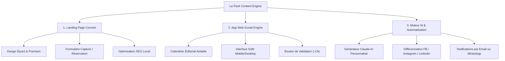

# Offre Package : Landing Page & App Génératrice de Posts
## Positionnement Commercial — Clockwork Ops (Stéphanie)

> [!NOTE]
> Cette offre est inspirée et capitalisée sur le travail réalisé avec succès pour **Le Manoïre**. Elle permet de packager notre expertise technique (Softr + Airtable + Make + Claude AI) sous forme de produit standardisé, hautement personnalisable et scalable à l'infini pour les professionnels indépendants et commerces locaux.

---

## 1. La Structure de l'Offre : Le Pack "Content Engine" 🚀
L'objectif est d'offrir une solution clé en main qui résout le plus grand problème des indépendants : **le manque de temps et d'inspiration pour nourrir leurs réseaux sociaux, tout en leur fournissant une page web moderne pour capter leurs clients.**

### A. Les 3 Piliers du Pack

#### 1. La Landing Page "Convert" 🌐
Une page unique, élégante et ultra-rapide, conçue pour convertir les visiteurs locaux en clients.
*   **Design Premium & Responsive** : Conforme aux meilleures pratiques (polices modernes, couleurs harmonieuses, responsive mobile-first).
*   **Capture de leads** : Intégration d'un formulaire de contact ou d'un outil de prise de rendez-vous (Calendly, Planity, Resalib, etc.).
*   **SEO Localisé** : Balises structurées pour que le professionnel apparaisse dans les recherches de sa ville/région.

#### 2. L'Application Web "Social Engine" (Softr + Airtable) 📱
Une interface privée, accessible sur smartphone ou ordinateur, qui sert de quartier général de leur communication.
*   **Tableau de Bord Intuitif** : Conçu pour quelqu'un qui n'aime pas la technique.
*   **Calendrier Éditorial Intelligent** : Affichage clair des posts prévus, en cours de rédaction ou publiés.
*   **Statut de Validation** : Un simple clic sur "Valider" marque le post comme prêt.

#### 3. Le Moteur IA "Custom Prompt" & Automatisation (Make) 🤖
Le cœur de la magie. Contrairement à un ChatGPT générique, l'IA est "dressée" pour leur métier et leur voix unique.
*   **Générateur de Posts IA 1-Clic** : En entrant juste une idée simple ("Je présente le nouveau soin du mois") ou en chargeant une photo, l'IA génère instantanément :
    *   Un texte **Facebook / LinkedIn** (avec des sauts de ligne clairs, des émojis dosés, et un lien d'appel à l'action court).
    *   Un texte **Instagram** (axé storytelling, sans lien cliquable inutile dans le texte, mais avec un CTA vers le lien en bio).
    *   Des **suggestions de visuels** à réaliser (guidage photo/vidéo) et les **hashtags locaux** pertinents.
*   **Contrôle Qualité ("Anti-Robot")** : En cas de refus ou si le texte ne convient pas, l'utilisateur clique sur "Demander une réécriture" avec une consigne simple (ex: "plus chaleureux", "plus court") et l'IA s'exécute immédiatement.

---

### B. Le Business Model & Tarification (Exemple indicatif)

Pour assurer une scalabilité et des revenus récurrents, l'offre se décompose ainsi :

| Élément | Format | Prix Conseillé | Valeur Perçue pour le Client |
| :--- | :--- | :--- | :--- |
| **Setup Initial** | Forfait unique | **1 490 € à 2 490 €** | Landing page + App Softr customisée + Intégration base Airtable + Configuration IA. |
| **Abonnement "Social Engine"** | Récurrent mensuel | **49 € à 99 € / mois** | Maintenance de la plateforme Softr/Airtable, hébergement, crédits de génération IA, support technique (WhatsApp). |

> [!TIP]
> **Option "Autopilote" (Upsell à +150€/mois)** : Connexion complète via Make pour publier automatiquement sur Facebook/Instagram dès que le client clique sur "Valider" dans son application, sans qu'il ait besoin de copier-coller.

---

## 2. Les 10 Avatars Clients les plus Percutants 🎯

Pour maximiser l'impact marketing, nous ciblons des **professionnels indépendants à forte valeur par client**, pour qui la présence sur les réseaux sociaux est vitale pour remplir leur agenda, mais qui manquent de temps et d'expertise éditoriale.

---

### 1. Sophie — L'Esthéticienne Indépendante (Institut de Beauté Premium)
*   **Profil** : Gère son propre salon esthétique (soins du visage, massage, technologies de pointe). Elle propose des prestations à forte marge (80€ - 150€ le soin).
*   **Problématique** : Elle doit montrer son expertise technique (pourquoi sa machine ou sa technique est supérieure) et rassurer. Elle publie des photos de ses cabines mais écrit des textes plats ("Nouveau soin disponible, contactez-moi").
*   **Le déclencheur d'achat** : Elle veut que ses posts reflètent le standing "haut de gamme" de son institut.
*   **Angle de post IA personnalisé** : 
    *   *Explications scientifiques vulgarisées* (ex: "Pourquoi l'acide hyaluronique fait cela à votre peau").
    *   *Promotions ciblées de saison* (ex: "Préparer sa peau pour le soleil en mai").
    *   *Bénéfice Landing Page* : Prise de rendez-vous directe intégrée.

### 2. Chloé — La Prothésiste Ongulaire & Nail Artist
*   **Profil** : Créative, minutieuse. Elle passe ses journées à faire des poses complexes. Elle est très active sur Instagram car c'est sa vitrine principale.
*   **Problématique** : Elle a des tonnes de magnifiques photos de mains, mais elle n'a *aucune idée* de quoi écrire en description à part "Pose nude du jour ✨ #nails". Elle passe à côté de l'opportunité de créer une vraie marque et d'attirer des clientes prêtes à payer plus cher pour son art.
*   **Le déclencheur d'achat** : En finir avec le syndrome de la page blanche sous ses posts quotidiens.
*   **Angle de post IA personnalisé** :
    *   *Storytelling client* (ex: "Aujourd'hui, Marie voulait du peps pour son mariage...").
    *   *Conseils d'entretien des ongles* (ex: "3 gestes pour garder votre pose 4 semaines intacte").
    *   *Hooks accrocheurs* pour ses vidéos Reels/TikTok montrant son travail en accéléré.

### 3. Thomas — Le Sophrologue & Praticien Holistique
*   **Profil** : Accompagne les personnes stressées, en burn-out ou en transition de vie.
*   **Problématique** : Il vend des bénéfices intangibles et invisibles (le bien-être, la sérénité). Il doit bâtir une relation de confiance profonde avant qu'un client n'ose l'appeler. ChatGPT standard écrit pour lui des textes trop robotiques ou clichés, ce qui détruit la confiance.
*   **Le déclencheur d'achat** : Obtenir des textes écrits avec une empathie sincère et une voix douce, respectant la déontologie.
*   **Angle de post IA personnalisé** :
    *   *Exercices pratiques guidés en texte* (ex: "Faites cette respiration de 3 minutes maintenant").
    *   *Décryptage des émotions* (ex: "Pourquoi votre corps stocke le stress dans vos épaules").
    *   *Témoignages anonymisés inspirants* (ex: "L'histoire de Julie, qui a retrouvé le sommeil").

### 4. Julie — L'Ostéopathe / Chiropracteur spécialisée "Posture & Dos"
*   **Profil** : Cabinet libéral, enchaîne les consultations de 8h à 20h. Elle adore enseigner la prévention mais n'a pas le temps de le faire en dehors de sa table de traitement.
*   **Problématique** : Elle sait que si elle donnait des conseils de posture sur les réseaux, elle attirerait les patients idéaux de sa région et réduirait ses appels d'urgence. Mais elle est épuisée en fin de journée.
*   **Le déclencheur d'achat** : Rentabiliser son savoir sans y passer ses soirées.
*   **Angle de post IA personnalisé** :
    *   *Astuces ergonomiques de bureau* (ex: "Comment régler votre écran pour sauver vos cervicales").
    *   *Décryptage des douleurs courantes* (ex: "Sciatique vs Douleur lombaire : comment savoir ?").
    *   *Exercices d'étirement rapides* illustrés par ses soins.

### 5. Maxime — Le Coach Sportif Personnel (Perte de poids & Remise en forme)
*   **Profil** : Coach indépendant travaillant en salle privée ou à domicile. Ses programmes coûtent plusieurs centaines d'euros par mois.
*   **Problématique** : Le marché des coachs est ultra-saturé. Il doit absolument prouver son autorité, motiver sa communauté et partager des transformations physiques (avant/après). Il n'a aucun sens de la formule écrite et ses appels à l'action sont trop timides ou agressifs.
*   **Le déclencheur d'achat** : Générer des scripts Reels dynamiques et des posts qui incitent les gens à postuler à son programme.
*   **Angle de post IA personnalisé** :
    *   *Scripts de hooks percutants pour Reels* (ex: "Arrête d'éliminer les glucides si tu veux perdre du ventre").
    *   *Storytelling de transformation* (ex: "Comment Laurent a perdu 8kg sans faim").
    *   *Posts motivationnels directs* (ex: "Le problème n'est pas ton manque de temps, c'est ta priorité").

### 6. Aurélie — La Coiffeuse & Coloriste Indépendante
*   **Profil** : Experte en balayages, ombrés et techniques de coloration complexes. Salon cosy ou à domicile. Prestations longues et coûteuses (120€ - 250€).
*   **Problématique** : Les clientes réservent sur photo. Elle a de superbes vidéos de "cheveux brillants au soleil" mais n'explique jamais la technicité (patine, protection du cheveu, diagnostic). Elle a aussi du mal à remplir ses créneaux creux (mardis/jeudis matins).
*   **Le déclencheur d'achat** : Remplir son agenda sur les jours calmes et attirer des clientes pour des techniques haut de gamme.
*   **Angle de post IA personnalisé** :
    *   *Vulgarisation technique coiffure* (ex: "Pourquoi une patine change TOUT après un balayage").
    *   *Offres flash créneaux creux* (ex: "Une pause douceur mardi matin ? -15% sur notre rituel soin").
    *   *Guide de soins capillaires de saison* (ex: "Sauver ses cheveux du chlore cet été").

### 7. Clara — La Professeure de Yoga & Pilates
*   **Profil** : Enseigne en studio ou organise ses propres retraites et ateliers le week-end. Elle vend une philosophie de vie.
*   **Problématique** : Elle a besoin d'animer sa communauté pour remplir ses cours hebdomadaires et vendre ses retraites (ticket plus élevé). Elle veut des textes inspirants, spirituels mais modernes, pas des clichés new-age ringards.
*   **Le déclencheur d'achat** : Vendre ses retraites et événements en 1 clic grâce à une communication fluide.
*   **Angle de post IA personnalisé** :
    *   *Méditations minute* et pensées du jour inspirantes.
    *   *Explications anatomiques d'une posture* (ex: "Ouvrir son cœur avec la posture du chameau").
    *   *Urgence douce pour événements* (ex: "Plus que 3 tapis disponibles pour notre atelier de dimanche").

### 8. Émilie — La Naturopathe & Conseillère en Nutrition
*   **Profil** : Spécialiste de la santé naturelle, de la digestion et des hormones féminines.
*   **Problématique** : Elle possède une quantité astronomique de connaissances scientifiques et théoriques. Son problème est qu'elle écrit des pavés indigestes et trop complexes sur les réseaux sociaux. Personne ne lit jusqu'au bout.
*   **Le déclencheur d'achat** : Transformer son savoir complexe en carrousels simples, digestes et engageants.
*   **Angle de post IA personnalisé** :
    *   *Structure Carrousel en 5 slides* (ex: "3 aliments insoupçonnés qui fatiguent votre foie").
    *   *Recettes saines express* (ex: "Le goûter anti-coup de barre de 16h").
    *   *Décryptages de symptômes* (ex: "Ventres gonflés le soir : la vraie cause").

### 9. Julien — L'Artisan Fleuriste Créatif
*   **Profil** : Boutique locale indépendante de fleurs et de décoration. Il propose des ateliers créatifs le week-end.
*   **Problématique** : Julien est un passionné de nature et de création manuelle, constamment au contact de ses fleurs ou de ses clients. Les réseaux sociaux sont une corvée qu'il fait à la va-vite tard le soir, alors qu'il a besoin de promouvoir ses fleurs de saison et de remplir ses ateliers floraux.
*   **Le déclencheur d'achat** : Ne plus avoir à réfléchir aux textes après une journée debout de 12 heures.
*   **Angle de post IA personnalisé** :
    *   *Poésie florale et saisonnalité* (ex: "La pivoine est arrivée : l'histoire derrière sa beauté éphémère").
    *   *Conseils d'entretien de bouquets* (ex: "L'astuce de grand-mère pour faire durer vos roses deux fois plus longtemps").
    *   *Promotion des ateliers créatifs* (ex: "Créez votre propre couronne de fleurs séchées samedi prochain").

### 10. Sarah & Nico — Les Gérants d'un Food Truck Local / Petit Resto de Quartier
*   **Profil** : Duo dynamique proposant une cuisine maison avec des produits frais du marché. Ils bougent d'emplacement chaque jour (pour le food truck) ou changent leur menu quotidiennement.
*   **Problématique** : Ils doivent annoncer leur menu du jour et leurs emplacements tous les matins avant 10h. S'ils ne le font pas ou s'ils le font avec un texte plat sans envie, ils font 50% de couverts en moins le midi. Écrire ce post tous les matins dans le rush de la cuisine est un enfer quotidien.
*   **Le déclencheur d'achat** : Générer le post du menu du jour en 30 secondes chrono depuis leur smartphone en cuisine.
*   **Angle de post IA personnalisé** :
    *   *Copywriting gourmand et salivant* (ex: "Aujourd'hui, le burger du marché coule de cheddar fermier... 🧀").
    *   *Infos pratiques immédiates* (ex: "📍 Retrouvez-nous de 12h à 14h sur le parvis de la gare").
    *   *Storytelling des producteurs locaux* (ex: "Nico revient tout juste du maraîcher avec ces magnifiques asperges...").

---

## 3. Synthèse de l'Alignement Stratégique 🎯

Ce pack est une réponse directe aux forces de **Clockwork Ops** :
1.  **Valorisation des compétences techniques** : Softr (interface utilisateur mobile-friendly), Airtable (base de données relationnelle structurée), Make (scénarios automatiques), Claude AI (personnalisation avancée de la tonalité).
2.  **Scalabilité absolue** : La structure technique globale reste identique d'un client à l'autre. Seul le *Prompt Système IA* et les *champs de typologie de posts dans Airtable* changent en fonction de l'avatar choisi.
3.  **Haut Retour sur Investissement (ROI) pour le client** : Un indépendant qui économise 4 heures de rédaction de posts par semaine et qui remplit mieux son agenda rentabilise le pack de setup et l'abonnement en seulement quelques semaines.

---

### Prochaines étapes suggérées pour avancer ensemble ("Le Grill") :
*   *Lequel de ces 10 avatars te semble le plus facile à prospecter dans ton réseau actuel (ex. Evian et alentours) ?*
*   *Veux-tu que l'on rédige en détail le **Prompt Système IA standardisé** (le prompt de Claude intégré dans Make) pour l'un de ces avatars afin de tester sa pertinence et sa tonalité ?*
*   *Souhaites-tu structurer la **maquette de la base Airtable** et de l'interface Softr correspondante pour pouvoir la cloner facilement ?*
