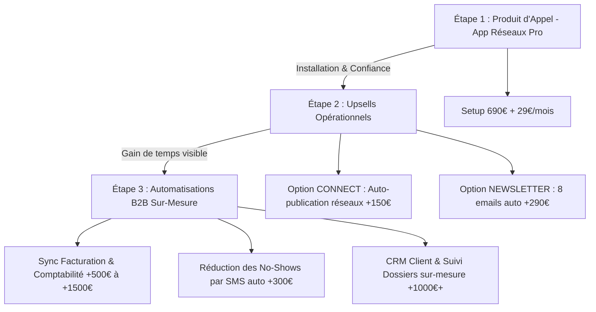

# Stratégie Produit d'Appel & Catalogue d'Upsells B2B
## Comment utiliser l'App Réseaux Pro comme cheval de troie pour vendre des automatisations à haute valeur ajoutée

> [!IMPORTANT]
> Ce document formalise la vision stratégique de Clockwork Ops : utiliser **L'App Réseaux Pro** comme un **produit d'appel (lead magnet payant)** irrésistible. Une fois la confiance installée et la relation client établie, nous activons un catalogue d'upsells (automatisations sur-mesure) pour augmenter drastiquement la valeur vie client (LTV).

---

## 1. Pourquoi c'est le Produit d'Appel Parfait ? 🎯

1.  **Visuel et Émotionnel** : Contrairement à un scénario Make en arrière-plan qui est invisible pour le client, une Landing Page pro et une Application mobile à leur nom génèrent un effet "Wow" immédiat.
2.  **Facile à comprendre** : Pas besoin d'expliquer ce qu'est un API ou un Webhook. Tu résous un problème douloureux (manque de temps pour les réseaux) de manière ultra-concrète.
3.  **Barrière à l'entrée basse** : Avec un tarif d'appel (ex: 690 € en France, ou offre de lancement "Partenaire"), l'indépendant prend un risque financier très faible. Tu entres dans son entreprise par la grande porte.

---

## 2. Le Parcours d'Évolution Client : Du Produit d'Appel aux Upsells 📈

Une fois le client installé sur son App Réseaux, tu deviens son **partenaire digital de confiance**. Tu es la personne vers qui il se tourne dès qu'il a un problème technique ou opérationnel. C'est là que tu proposes tes services à haute valeur ajoutée.

---

## 3. Le Catalogue des Upgrades & Upsells à Proposer

Voici les modules que tu peux lui proposer après 1 ou 2 mois d'utilisation réussie de son application :

### A. Les Upgrades directes de l'App (Niveau Opérationnel)
Ces suppléments complètent l'application existante sans créer de nouveau système :
1.  **L'Option "Connect" (+150 € setup +10 €/mois)** : Liaison automatique de l'app à leurs comptes Facebook & Instagram via Make pour publier en 1 clic sans copier-coller.
2.  **L'Option "Newsletter Auto" (+290 € setup +15 €/mois)** : Configuration d'une séquence de bienvenue automatique et de 8 newsletters saisonnières pour relancer leur fichier de clients inactifs (exactement comme le livrable newsletters du Manoïre !).

---

### B. Les Automatisations Business (Niveau Management & Chiffre d'Affaires)
En discutant avec ton client, tu vas repérer ses autres "points de douleur" administratifs. C'est ici que tu vends ton expertise de Product Builder à forte valeur :

#### 1. Système Anti-Oubli & Réduction des "No-Shows" (+290 € à +490 € forfait unique)
*   *Le problème* : Les rendez-vous manqués (clients qui oublient de venir) coûtent des centaines d'euros par mois aux salons et cabinets.
*   *Ta solution* : Une automatisation Make connectée à leur outil de réservation (Planity, Calendly) qui envoie un SMS de rappel ultra-personnalisé et chaleureux la veille du rendez-vous, avec un lien pour reporter si besoin.

#### 2. Synchronisation Facturation & Comptabilité (+490 € à +1 490 € forfait unique)
*   *Le problème* : L'indépendant passe ses dimanches à saisir ses factures de vente dans son logiciel comptable.
*   *Ta solution* : Liaison automatique entre leur outil d'encaissement/réservation et leur logiciel de facturation ou leur tableau de bord comptable (Airtable / Google Sheets / QuickBooks), éliminant toute double saisie manuelle.

#### 3. CRM Client & Suivi des Fiches Dossiers (+790 € à +1 990 € forfait unique)
*   *Le problème* : Les ostéopathes ou thérapeutes ont du mal à suivre l'historique des consultations de leurs patients sur des fiches papier volantes.
*   *Ta solution* : Une base de données relationnelle sécurisée sur Airtable avec une interface privée pour consigner les notes cliniques, exercices recommandés et suivi d'un rendez-vous à l'autre.

---

## 4. Posture Commerciale : Comment pitcher l'Upsell ? 🗣️

Ne fais jamais de vente agressive. Utilise la posture de **l'audit bienveillant** lors de ton appel mensuel de suivi (offert dans leur abonnement) :

> *"Sophie, je suis ravie de voir que ton application réseaux te fait gagner 4h par semaine ! En regardant ton fonctionnement, j'ai remarqué que tu passais encore beaucoup de temps à relancer manuellement les clients pour leurs factures à la fin du mois. Si tu veux, je peux te brancher un petit système automatique pour que tes factures se génèrent toutes seules dès qu'un client réserve sur Planity. Tu serais tranquille avec ça ?"*

Le client dit oui presque à chaque fois, car il a déjà expérimenté la qualité de ton premier produit.
